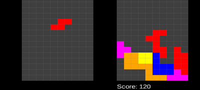
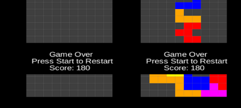

# LeTetris

[](https://www.gnu.org/licenses/gpl-3.0)

LeTetris is a Tetris-inspired game designed to help train binocular cooperation for amblyopia (lazy eye). It features dual fields — one for falling blocks and one for frozen blocks — to encourage simultaneous visual engagement from both eyes. It has only been tested in an old fashioned phone head mount (like the classic Cardboard).

[](screenshots/screenshot.png)
[](screenshots/game_over.png)

## Features

- Classic Tetris mechanics with a twist
- Side-by-side falling and frozen fields
- Controller support (USB/Bluetooth)
- Touchscreen-friendly UI (Android)
- Cross-platform: Desktop and Android builds

## Controls

### Desktop
- Space: start
- Arrow keys: move/rotate blocks
- `R`: Restart after game over

### Android and Desktop
- Controller support (via USB or Bluetooth)
- Start button: start/restart
- A/B/X/Y buttons or joystick: rotate/move blocks

## Development

This game is built using [libGDX](https://libgdx.com/) and Kotlin.

### Requirements

- JDK 17+
- Android SDK
- Gradle

### Build and Run

```bash
# Desktop
./gradlew desktop:run

# Android (install to connected device)
./gradlew android:assembleDebug
adb install -r android/build/outputs/apk/debug/android-debug.apk
